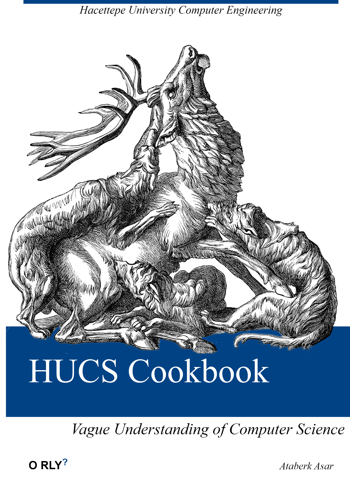

# Hacettepe University Computer Engineering 2021 - Today

- Codes that I write while studying at university
- These codes may not be efficient, or reliable; since I am not an expert but a student at the moment

> [BBM103 Introduction to Programming Lab I](https://github.com/AtaberkAsar/HUCS-Cookbook/tree/main/BBM103)
>
> Basic concepts of computer programming. Problem formalization and developing algorithms, structured programming, basic control structures, file operations.

> [BBM104 Introduction to Programming Lab II](https://github.com/AtaberkAsar/HUCS-Cookbook/tree/main/BBM104)
>
> Basic concepts of object oriented programming. Introduction to learning of an object oriented programming language. Class, object, encapsulation, inheritance, polymorphism, abstract class and interface. Access specifiers and messaging. Exception handling concepts.

> [BBM203 Software Laboratory I](https://github.com/AtaberkAsar/HUCS-Cookbook/tree/main/BBM203)
>
> Fundamentals of data structures. Relationships between data representation, algorithm design, and program efficiency. Lists, stacks, queues, trees, priority queues, hashing, graphs. Multi-dimensional/triangular/band/sparse matrix representations. Single/double (circular) linked lists. Prefix/infix/postfix expressions.

> [BBM204 Software Laboratory II](https://github.com/AtaberkAsar/HUCS-Cookbook/tree/main/BBM204)
>
> Basic concepts of algorithms. Asymptotic notation, performance measurement, space/time complexity. Recursive algorithms, recursive relations, introduction to the concept of algorithm analysis. Binary search tree, recursive and iterative binary tree traversals. Graphs, depth/breadth first search, spanning trees, shortest path problem, activity on vertex/edge networks. Selection, insertion, bubble, counting, quick, merge, heap, radix sorting algorithms and their analysis.

> [BBM325 Internship I](https://github.com/AtaberkAsar/HUCS-Cookbook/tree/main/BBM325)
>
> At the end of the internship, the student will implement a project and work in an organization.

> [BBM409 Machine Learning Laboratory](https://github.com/AtaberkAsar/HUCS-Cookbook/tree/main/BBM409)
>
> Overview of Machine Learning, Linear Regression, Least Squares, Machine Learning Methodology, Probability and Linear Algebra Basics, Statistical Estimation: MLE, MAP, Naive Bayes Classifier, Linear Classification Models: Logistic Regression, Linear Discriminant Functions, Perceptron, Support Vector Machines, Decision Tree Learning, Ensemble Methods: Bagging, Boosting, Clustering, Neural Networks, Principle Component Analysis

> [BBM411 Fundamentals of Bioinformatics](https://github.com/AtaberkAsar/HUCS-Cookbook/tree/main/BBM411)
>
> Foundations of molecular biology and genetics and the structure and properties of data produced at various levels, DNA and protein sequence analysis, protein 3-D structures and analysis, annotation and prediction of gene and protein functions, phylogenomics and population genetics, gene expression analysis, systems biology and biological networks.

> [BBM418 Computer Vision Laboratory](https://github.com/AtaberkAsar/HUCS-Cookbook/tree/main/BBM418)
>
> Practical applications of digital image fundamentals. Linear image filtering and correlation, non-linear filtering, image enhancement, histogram modification techniques, image restoration, image compression, frequency domain processing and segmentation.

> [BBM425 Internship II](https://github.com/AtaberkAsar/HUCS-Cookbook/tree/main/BBM425)
>
> At the end of the internship, the student will implement a project and work in an organization.

### References
- [Hacettepe University Computer Engineering Undergraduate Curriculum](https://www.cs.hacettepe.edu.tr/#curriculum_ce)
- [USF ClipArt ETC](https://etc.usf.edu/clipart)
